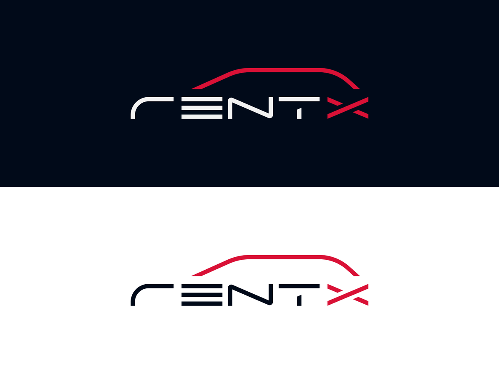

   

> Um app para alugar carros. :car:

### Layout da aplicação

Acesse o arquivo no Figma com todas as páginas do app [aqui](https://www.figma.com/file/7Ro0D8mdcX36qWnSBhWaXF/RentX?node-id=0%3A1).

### :construction_worker: Como rodar na sua máquina

### Clone o repositório

bash

# Clone o Repositório

$ git clone https://github.com/renatodaltiba/rentx.git

bash

# Instalar depedências

$ yarn

# Iniciar aplicação no expo

$ yarn start

Depois leia o QRCode com o app do [expo](https://play.google.com/store/apps/details?id=host.exp.exponent) ou rode em um emulador.

# :tada: Obrigado!

### Autor

👤 _Renato Daltiba Schneider_

- Github: [@renatodaltiba](https://github.com/renatodaltiba)
- LinkedIn: [@renatodaltiba](https://www.linkedin.com/in/renatodaltiba/)

## Licença

The [MIT License]() (MIT)

Copyright :copyright: 2021
